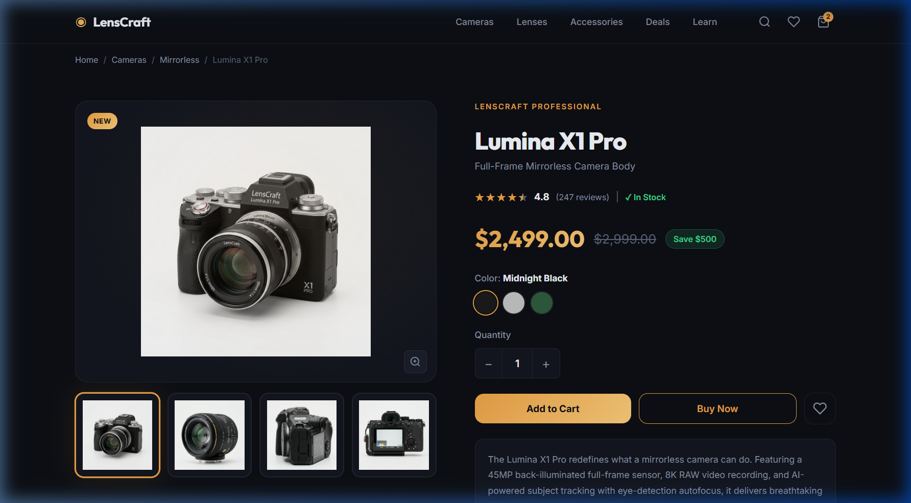
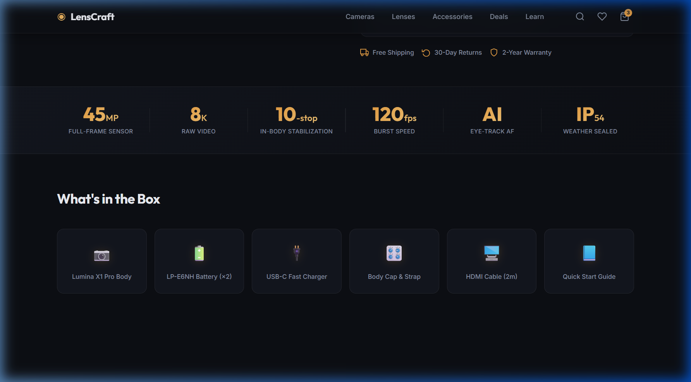
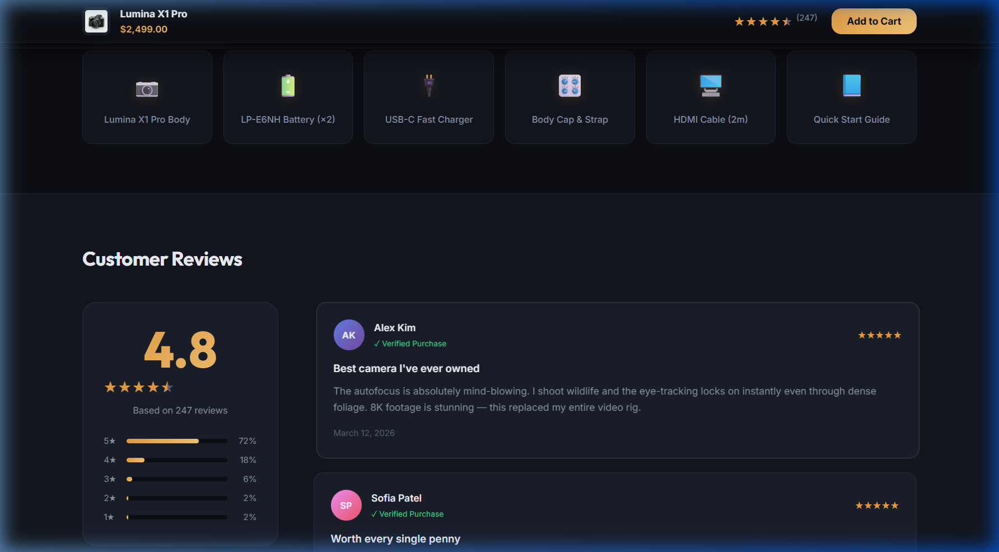
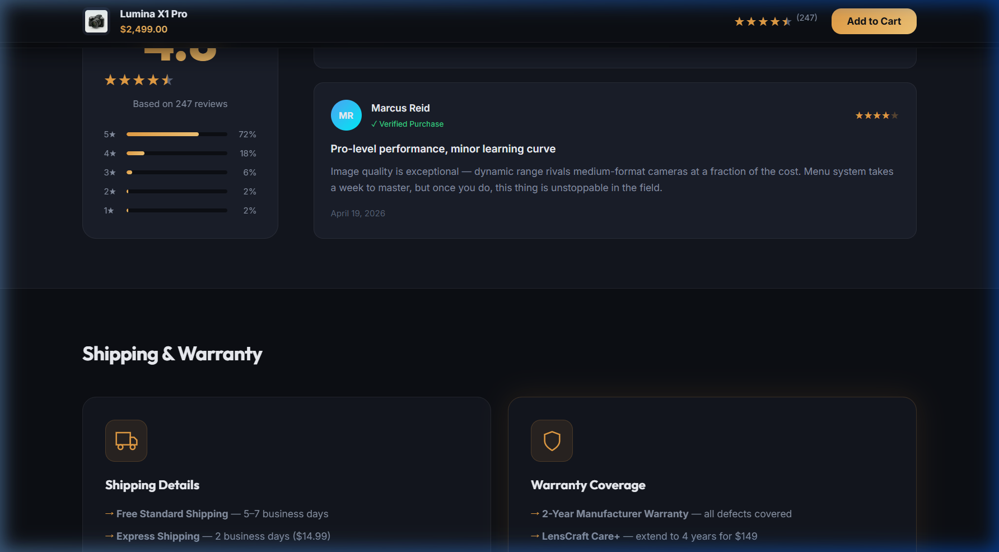
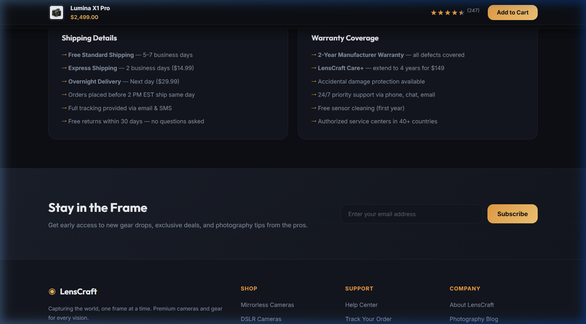
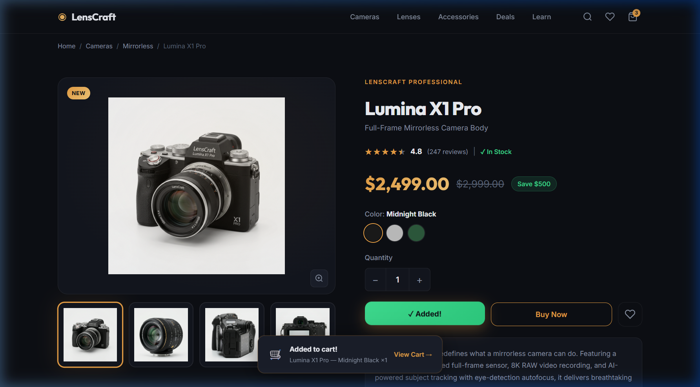
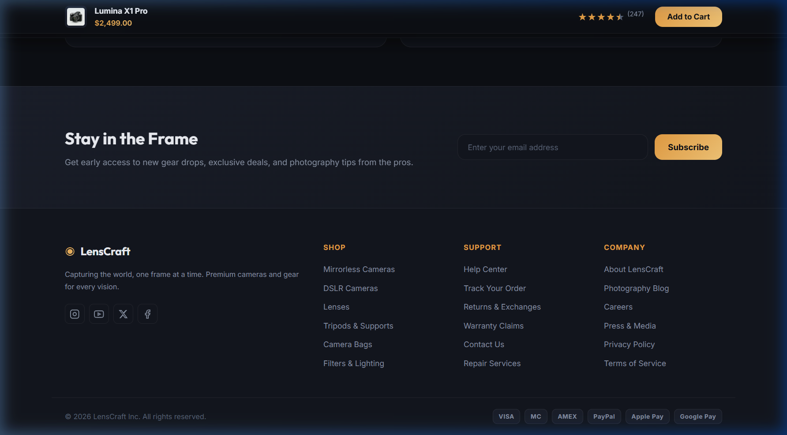

# ◉ LensCraft — Premium Camera Store Product Page

> A stunning, fully interactive **e-commerce product page** mockup for a fictional camera brand, built with pure **HTML · CSS · JavaScript** — no frameworks, no dependencies.

[](https://chiranjeevisegu.github.io/LensCraft/)
[](https://developer.mozilla.org/en-US/docs/Web/HTML)
[](https://developer.mozilla.org/en-US/docs/Web/CSS)
[](https://developer.mozilla.org/en-US/docs/Web/JavaScript)

---

## 📸 Screenshots

### Hero — Product Gallery & Info


### Spec Strip — Key Specifications at a Glance


### What's in the Box


### Customer Reviews — Rating Breakdown + Review Cards


### Shipping & Warranty Info Cards


### Toast Notification — Add to Cart Feedback


### Newsletter & Footer


---

## ✨ Features

### 🎨 Design
| Feature | Detail |
|---|---|
| **Dark Mode** | Full dark theme with `#0d0f14` base and layered surfaces |
| **Gold Accent System** | Gradient `#e8a045 → #f5c878` used consistently throughout |
| **Typography** | Google Fonts — `Outfit` (headings) + `Inter` (body) |
| **Glassmorphism Header** | Sticky frosted-glass navigation bar |
| **Micro-animations** | Hover lifts, scale transforms, color transitions on every element |

### 🧩 Page Sections
| Section | Description |
|---|---|
| **Header** | Sticky logo, 5-item nav, search / wishlist / cart icons with live badge |
| **Breadcrumb** | Semantic navigation trail |
| **Product Gallery** | Main image + 4 clickable thumbnails with fade transition |
| **Product Info** | Name, brand tag, 4.8★ rating, price / original price / savings badge, In Stock |
| **Color Selector** | 3 swatches (Midnight Black / Titanium Silver / Forest Green) |
| **Quantity Control** | +/− stepper capped at 1–10 |
| **CTAs** | Add to Cart, Buy Now, Wishlist heart toggle |
| **Product Description** | 60-word spec-rich copy |
| **Spec Strip** | 45MP · 8K · 10-stop · 120fps · AI AF · IP54 with gold gradient numbers |
| **What's in the Box** | 6-item staggered card grid |
| **Customer Reviews** | Animated rating bars + 3 verified review cards with gradient avatars |
| **Shipping & Warranty** | Two detailed info cards |
| **Newsletter** | Email subscribe form |
| **Footer** | 4-column links, 4 social icons, 6 payment chips, copyright |

### ⚡ Interactivity
| Feature | Behaviour |
|---|---|
| **Toast Notification** | Bounces up from bottom with spring animation on cart add — shows colour × qty |
| **Sticky Cart Bar** | Slides in from the top when you scroll past the hero — always-visible CTA |
| **Lightbox Modal** | Click zoom button or double-click image → fullscreen modal with thumbnail strip; `Esc` to close |
| **Scroll Reveal** | Sections fade + slide up on viewport enter via `IntersectionObserver` |
| **Staggered Inbox** | "What's in the Box" cards enter with 60 ms delay between each |
| **Rating Bar Animation** | Bars animate from 0% to their value only when scrolled into view |
| **Thumbnail Switcher** | Fade-transition on main image swap |
| **Wishlist Toggle** | Heart fills red on click |

---

## 🗂️ File Structure

```
LensCraft/
├── index.html          # Full page markup (semantic HTML5)
├── style.css           # All styling — design system, components, responsive, animations
├── script.js           # All interactivity — no libraries
├── camera_main.png     # AI-generated hero product image
├── camera_thumb2.png   # Lens thumbnail
├── camera_thumb3.png   # Side view thumbnail
├── camera_thumb4.png   # Rear view thumbnail
└── screenshots/
    ├── hero.png
    ├── specs.png
    ├── inbox.png
    ├── reviews.png
    ├── shipping.png
    ├── toast.png
    └── footer.png
```

---

## 🚀 Running Locally

No build step needed — this is pure HTML/CSS/JS.

**Option 1 — Python server:**
```bash
cd LensCraft
python -m http.server 5500
# Open http://localhost:5500
```

**Option 2 — VS Code Live Server:**
Install the [Live Server extension](https://marketplace.visualstudio.com/items?itemName=ritwickdey.LiveServer), right-click `index.html` → *Open with Live Server*.

**Option 3 — Just open the file:**
Double-click `index.html` — works with no server for basic viewing (images may not load in some browsers without a server).

---

## 🎨 Design Tokens

```css
--clr-bg:        #0d0f14   /* Page background */
--clr-surface:   #13161e   /* Card surface */
--clr-surface2:  #1a1e2a   /* Elevated surface */
--clr-accent:    #e8a045   /* Gold accent */
--clr-gold-grad: linear-gradient(135deg, #e8a045, #f5c878)
--clr-green:     #3dd68c   /* Success / In-stock */
--clr-text:      #f0f2f8   /* Primary text */
--clr-muted:     #8892a4   /* Secondary text */
```

---

## 📋 Product Details (Mockup Data)

**LensCraft Lumina X1 Pro** — Full-Frame Mirrorless Camera Body

- **Sensor:** 45MP back-illuminated full-frame BSI-CMOS
- **Video:** 8K RAW recording
- **Stabilisation:** 10-stop In-Body Image Stabilisation (IBIS)
- **Autofocus:** AI Eye-Detection with subject tracking
- **Burst:** 120 fps continuous shooting
- **Weather Sealing:** IP54 rated magnesium alloy body
- **Price:** $2,499.00 (RRP $2,999.00 — Save $500)
- **Rating:** 4.8★ based on 247 verified reviews

---

## 🛠️ Tech Stack

| Technology | Usage |
|---|---|
| **HTML5** | Semantic structure, ARIA labels, breadcrumb, article tags |
| **Vanilla CSS3** | Custom properties, Grid, Flexbox, `@keyframes`, `backdrop-filter`, `IntersectionObserver`-driven classes |
| **Vanilla JavaScript (ES6+)** | All interactivity — no jQuery, no frameworks |
| **Google Fonts** | Outfit + Inter via CDN |
| **Inline SVG** | All icons hand-coded SVG (no icon libraries) |

---

## 🌐 Browser Support

| Browser | Support |
|---|---|
| Chrome 90+ | ✅ Full |
| Firefox 90+ | ✅ Full |
| Safari 14+ | ✅ Full |
| Edge 90+ | ✅ Full |

---

## 📄 License

MIT License — free to use, modify, and distribute.

---

<div align="center">
  <strong>Built with ♥ — LensCraft © 2026</strong>
</div>
